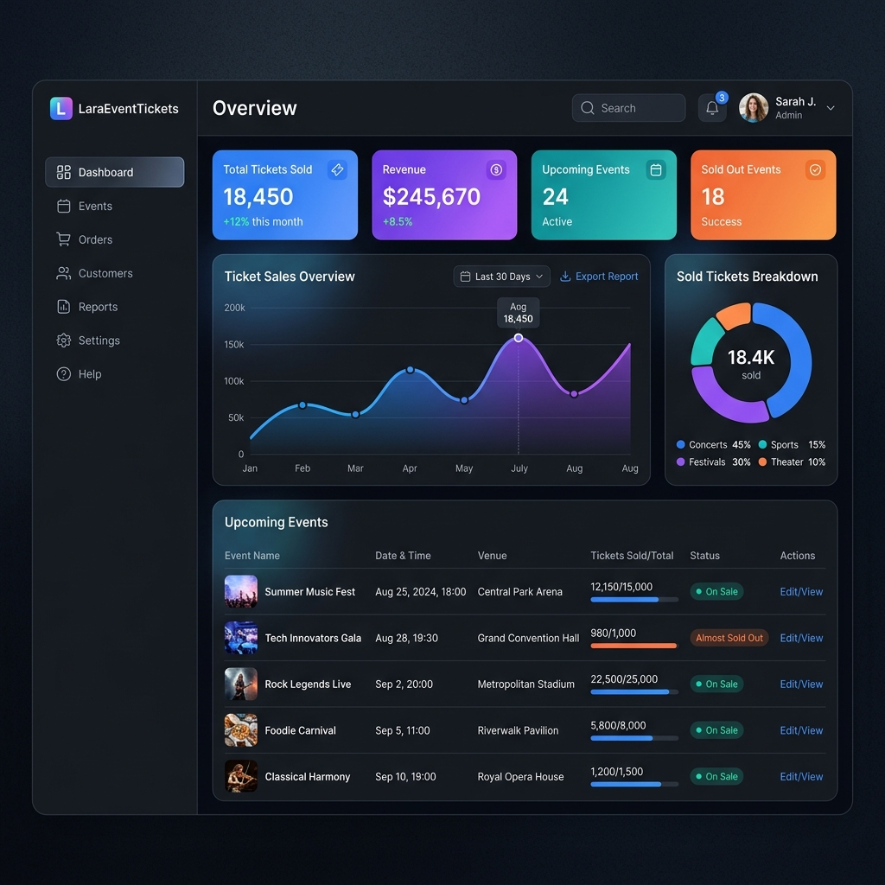

# LaraEventTickets

[](LICENSE)
[](https://laravel.com)

A premium, Laravel-based system designed for event organizers to seamlessly manage events, tickets, and online payments.

---

## 🎨 Dashboard Preview



---

## ✨ Features

- 🎟️ **Event Management:** Create and edit events with custom venues, descriptions, and schedules.
- 💳 **Online Ticket Sales:** Integrated with Stripe Cashier for direct credit card ticketing checkout.
- 📱 **Sleek Mobile Tickets:** Digital ticketing designs optimised for mobile wallets and barcodes.
- 👥 **Role-Based Access Control:** Built-in Admin panel powered by QuickAdminPanel for managing Users, Roles, and Permissions.
- 📈 **Ticketing Reports:** Clear reporting showing amount of tickets sold and payment logs.

---

## 📱 Mobile Ticket Experience


---

## 🚀 Quick Start & Installation

### Default Admin Credentials
* **Email:** `admin@admin.com`
* **Password:** `password`

### System Requirements
* PHP `>= 5.6.4`
* MySQL / MariaDB
* Composer

### Installation Instructions

1. **Clone the repository:**
   ```bash
   git clone https://github.com/vijaymahes9080/LaraEventTickets-QuickAdminPanel_php.git
   cd LaraEventTickets-QuickAdminPanel
   ```

2. **Configure Environment:**
   Copy `.env.example` to `.env` and set up your database details:
   ```bash
   cp .env.example .env
   ```

3. **Install Dependencies:**
   ```bash
   composer install
   ```

4. **Generate Application Key:**
   ```bash
   php artisan key:generate
   ```

5. **Run Database Migrations & Seeds:**
   ```bash
   php artisan migrate --seed
   ```

6. **Serve the Application:**
   ```bash
   php artisan serve
   ```
   Now visit `http://localhost:8000/login` to access the Admin Panel with the default credentials above.

---

## 🛠️ Technology Stack
* **Backend Framework:** Laravel 5.4
* **Theme & UI:** AdminLTE (Bootstrap 3)
* **Packages:**
  * `laravel/cashier` for billing integrations.
  * `intervention/image` for media management.
  * `laravelcollective/html` for forms & helper elements.

---

## 📄 License
This project is open-source software licensed under the [MIT License](LICENSE).
